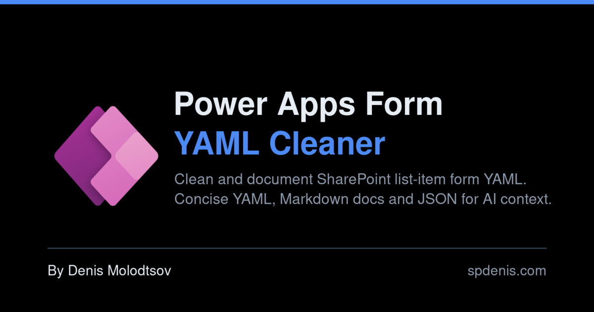
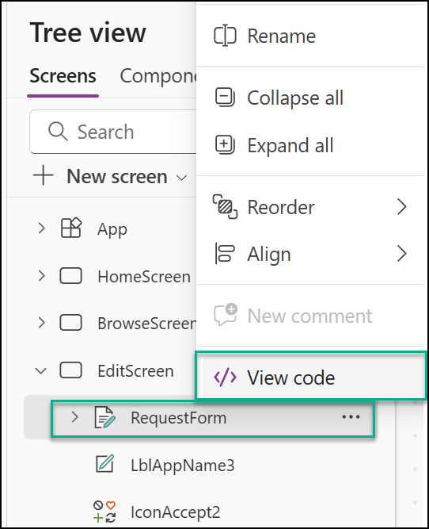
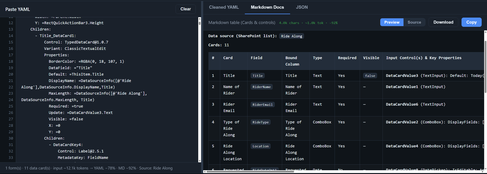

  

  

Turn the noisy YAML behind a SharePoint list-item form into clean, readable
documentation.

This tool is for SharePoint **list-item forms** customized with Power Apps (Canvas), not
general Canvas Apps. It strips the cosmetic clutter (positions, colors, padding, helper
labels) and keeps only what matters: fields, controls, defaults, rules, and your
SharePoint data source. You get back tidy YAML, a Markdown table, and JSON. Great for
documentation, and a compact way to feed a form to an AI without wasting tokens.

## How to use it

1. In Power Apps Studio, open the **Tree view**, right-click your form, and choose
   **View code**.

   

2. Copy the YAML, then paste it into the box on the left of the site.

3. Read or copy the result on the right: **Cleaned YAML**, **Markdown Docs**, or **JSON**.

   

That's the whole flow. Paste a whole form or just a single data card, both work.

## Good to know

Everything runs in your browser. Nothing is uploaded.

Use the **Filters & options** bar to tweak what the output includes (events, Visible,
diagnostics, and more).

Built by [Denis Molodtsov](https://spdenis.com/).
